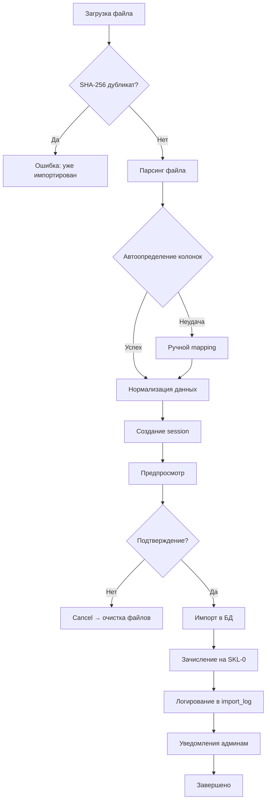
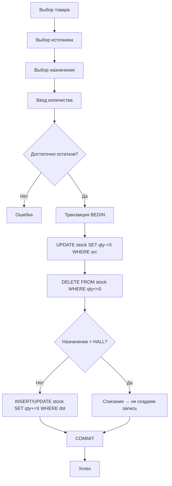
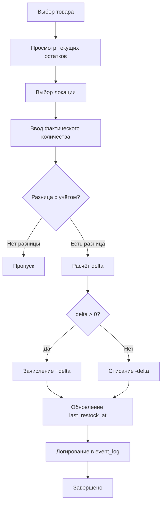
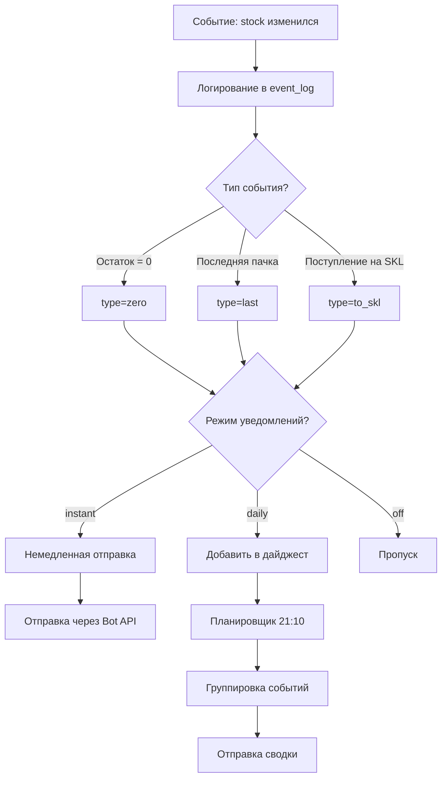
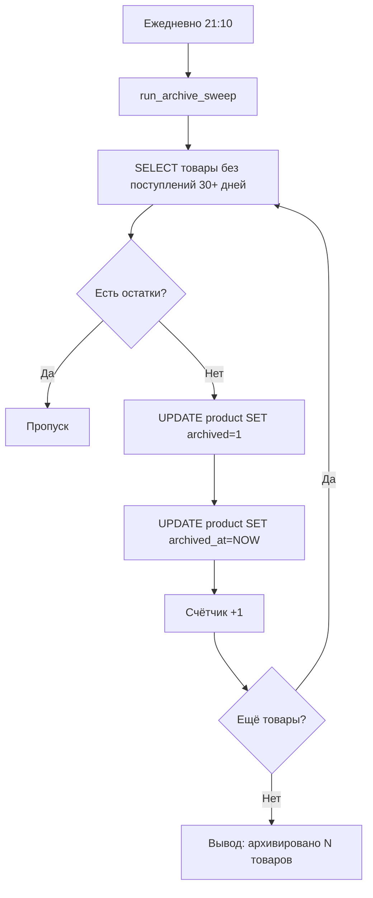

# AGENTS.md — Comprehensive Guide for AI Agents

> **Полное техническое руководство** для AI-агентов, работающих с репозиторием **Dvorik** — складским Telegram-ботом с веб-админкой для управления оффлайн-магазином.

## 📋 Содержание

- [Обзор проекта](#обзор-проекта)
- [Быстрый старт для агентов](#быстрый-старт-для-агентов)
- [Архитектура](#архитектура)
- [Структура репозитория](#структура-репозитория)
- [Ключевые компоненты](#ключевые-компоненты)
- [Детальный обзор модулей](#детальный-обзор-модулей)
- [Паттерны и соглашения](#паттерны-и-соглашения)
- [База данных](#база-данных)
- [API и Endpoints](#api-и-endpoints)
- [Бизнес-логика и Workflows](#бизнес-логика-и-workflows)
- [Работа с кодом](#работа-с-кодом)
- [Тестирование](#тестирование)
- [Развертывание](#развертывание)
- [Troubleshooting](#troubleshooting)
- [Performance & Optimization](#performance--optimization)
- [Security](#security)
- [FAQ](#faq)

---

## Быстрый старт для агентов

### 🎯 Первые 5 минут

1. **Прочитать файлы** (в этом порядке):
   - `README.md` — общее описание
   - `app/config.py` — конфигурация
   - `app/constants.py` — константы
   - `app/db.py` (строки 1-200) — схема БД
   - `app/main.py` — точка входа

2. **Ключевые директории**:
   - `app/handlers/` — обработчики команд бота
   - `app/services/` — вся бизнес-логика
   - `admin_ui/blueprints/` — API endpoints веб-админки
   - `admin_ui/templates/` — UI шаблоны

3. **Основные модули** для изменений:
   - **Импорт поставок**: `app/services/imports.py`
   - **Складские операции**: `app/services/stock.py`
   - **Уведомления**: `app/services/notify.py`
   - **Web API**: `admin_ui/blueprints/*.py`

### 🚀 Быстрые команды

```bash
# Запуск локально
python -m app.main          # Бот
python -m admin_ui          # Веб-админка (http://localhost:8000)

# Docker
docker compose up -d        # Запуск всего стека
docker compose logs -f bot  # Логи бота

# Тесты
pytest                      # Все тесты
python stress_test.py       # Интеграционные тесты

# Код-стиль
flake8 app/ admin_ui/       # Линтинг
```

### 📊 Диаграмма потока данных

```
[Поставщик] → [Excel/CSV файл]
       ↓
[Веб-админка: /supply]
       ↓
[imports.py: парсинг + нормализация]
       ↓
[DB: product + stock (SKL-0)]
       ↓
[notify.py: уведомления админам]
       ↓
[Telegram-бот: сообщения]
```

### 🔑 Ключевые концепции

| Концепт | Описание |
|---------|----------|
| **SKL-0** | Главный склад, куда поступают все новые товары |
| **Локация** | Место хранения (склад/домик/зал/стойка) |
| **Нормализация** | Очистка данных поставки (артикулы, названия, количество) |
| **Session** | Временное хранилище данных импорта (30 мин TTL) |
| **Архивация** | Автоматическое скрытие товаров без поступлений 30+ дней |
| **FTS5** | Полнотекстовый поиск по товарам |
| **WAL режим** | Write-Ahead Logging для параллельного доступа к SQLite |

---

## Обзор проекта

**Dvorik** — Python-приложение для управления складом оффлайн-магазина через Telegram-бота и веб-интерфейс.

### Основные технологии
- **Python 3.12**
- **aiogram 3.7** — Telegram Bot API
- **Flask 3.0** — веб-админка
- **SQLite** с WAL-режимом
- **pandas, openpyxl, xlrd** — импорт Excel/CSV
- **Pillow** — обработка изображений

### Ключевой функционал
1. **Импорт поставок** из CSV/XLS с автоматической нормализацией
2. **Управление остатками** по локациям (склады, домики, зал, стойка)
3. **Инвентаризация** с атомарными корректировками
4. **Уведомления** о нулевых остатках, новых поставках
5. **График продавцов** с обменом сменами
6. **Веб-админка** для просмотра/редактирования данных

---

## Архитектура

```
┌─────────────────────────────────────────────────────────┐
│                   Telegram Bot (aiogram)                │
│  app/main.py → app/routers.py → app/handlers/*          │
└─────────────────┬───────────────────────────────────────┘
                  │
                  ├──→ app/services/* (бизнес-логика)
                  │
                  └──→ app/db.py (SQLite + WAL)
                       ↑
                  ┌────┴────────────────────────────────────┐
                  │     Flask Admin UI (admin_ui/)          │
                  │  server.py → blueprints/* → templates/  │
                  └─────────────────────────────────────────┘
```

### Разделение ответственности

- **app/main.py** — точка входа бота, инициализация, планировщик задач
- **app/routers.py** — регистрация хендлеров
- **app/handlers/** — обработчики Telegram-событий (команды, колбэки, inline-запросы)
- **app/services/** — бизнес-логика (импорт, склад, уведомления, расписание)
- **app/db.py** — схема БД, миграции, утилиты
- **admin_ui/** — Flask-приложение с Bootstrap-шаблонами

---

## Структура репозитория

```
Dvorik/
├── app/                      # Telegram-бот
│   ├── main.py              # Точка входа
│   ├── bot.py               # Bot/Dispatcher (legacy)
│   ├── config.py            # Конфигурация (пути, токены)
│   ├── db.py                # Схема БД, миграции
│   ├── routers.py           # Регистрация роутеров
│   ├── constants.py         # Константы (локации, лимиты)
│   ├── utils*.py            # Утилиты (файлы, числа)
│   ├── handlers/            # Обработчики Telegram
│   │   ├── core.py          # /start, /help
│   │   ├── supply.py        # Поставки
│   │   ├── product.py       # Карточки товаров
│   │   ├── inventory.py     # Инвентаризация
│   │   ├── reports.py       # Отчеты
│   │   ├── schedule.py      # График
│   │   └── ...
│   ├── services/            # Бизнес-логика
│   │   ├── imports.py       # Импорт CSV/Excel
│   │   ├── stock.py         # Складские операции
│   │   ├── notify.py        # Уведомления
│   │   ├── schedule.py      # Расписание
│   │   ├── photos.py        # Фотографии
│   │   ├── archival.py      # Архивация
│   │   └── ...
│   └── ui/                  # UI-компоненты (клавиатуры)
│
├── admin_ui/                # Flask веб-админка
│   ├── __init__.py
│   ├── __main__.py          # python -m admin_ui
│   ├── server.py            # Flask app factory
│   ├── context.py           # Контекстные процессоры
│   ├── blueprints/          # Роуты
│   │   ├── home.py          # Главная
│   │   ├── supply.py        # Поставки
│   │   ├── cards.py         # Карточки
│   │   ├── inventory.py     # Инвентаризация
│   │   ├── schedule.py      # График
│   │   ├── tables.py        # Браузер таблиц
│   │   └── ...
│   ├── templates/           # Jinja2 шаблоны
│   │   ├── base.html        # Базовый шаблон
│   │   ├── supply.html      # UI поставок
│   │   ├── cards.html       # Карточки товаров
│   │   └── ...
│   └── static/              # CSS, JS, изображения
│
├── scripts/                 # Утилиты
│   └── xls_to_csv.py        # Конвертер .xls → CSV
│
├── tests/                   # Тесты
│   ├── test_imports.py      # Тесты импорта
│   └── ...
│
├── data/                    # Runtime данные (создается автоматически)
│   ├── marm.sqlite3         # База данных
│   └── uploads/             # Загруженные файлы
│       └── normalized/      # Нормализованные CSV
│
├── media/                   # Медиа-файлы
│   └── photos/              # Фотографии товаров
│
├── reports/                 # Сгенерированные отчеты (CSV, PNG, PDF)
│
├── .github/workflows/       # CI/CD
│   └── cicd.yml             # GitHub Actions
│
├── requirements.txt         # Python-зависимости
├── Dockerfile               # Docker-образ
├── docker-compose.yml       # Compose-стек
├── .env.example             # Пример конфигурации
├── stress_test.py           # Стресс-тесты
├── run_bot.command          # Запуск бота (macOS)
├── run_admin.command        # Запуск админки (macOS)
└── README.md                # Документация
```

---

## Ключевые компоненты

### 1. Импорт поставок (app/services/imports.py)

**Основные функции:**
- `excel_to_normalized_csv(path, column_mapping, sheet_path)` — парсинг Excel в CSV
- `csv_to_normalized_csv(path)` — парсинг CSV
- `import_supply_rows(rows, supplier)` — импорт нормализованных строк в БД
- `compute_sha256(path)` — хеш файла для защиты от дубликатов
- `record_import_log(...)` — запись в журнал импорта

**Логика:**
1. Загрузка файла → вычисление SHA-256
2. Проверка дубликатов по `import_log.source_hash`
3. Автоопределение структуры:
   - Поиск секции "Товары (работы, услуги)"
   - Определение колонок артикула, названия, количества
4. Если не удалось → `needs_mapping=True` (ручной выбор в UI)
5. Нормализация:
   - Очистка названий от лишних подписей
   - Санитизация артикулов (убрать *, •, пробелы)
   - Парсинг количества (замена `,` на `.`)
6. Создание/обновление товаров в БД
7. Зачисление на `SKL-0` (главный склад)

**Важные детали:**
- Поддержка `.csv`, `.xls`, `.xlsx`
- Для `.xls` используется `xlrd`/`xlrd2`
- Автоматическое извлечение метаданных (поставщик, счет)
- Сохранение в `import_session` для продолжения после перезапуска

### 2. Складские операции (app/services/stock.py)

**Основные функции:**
- `move_stock(product_id, from_loc, to_loc, qty)` — перемещение
- `adjust_stock(product_id, location, delta)` — корректировка
- `get_stock(product_id)` — получение остатков по всем локациям

**Правила:**
- Нельзя уйти в минус
- Все операции в транзакциях
- Логирование в `event_log` для уведомлений
- Обновление `last_restock_at` при зачислении

### 3. Уведомления (app/services/notify.py)

**Типы событий:**
- `zero` — остаток закончился
- `last` — последняя пачка
- `to_skl` — новое поступление на склад

**Режимы:**
- `off` — выключено
- `daily` — ежедневная сводка (21:10)
- `instant` — мгновенно

**Функции:**
- `notify_instant_zero(bot, pid)` — уведомление о нуле
- `send_daily_digests(bot)` — рассылка дневных сводок

### 4. Расписание (app/services/schedule.py)

**Таблицы:**
- `schedule_day` — открытые/закрытые дни
- `schedule_assignment` — назначения (2 продавца на день)
- `schedule_transfer_request` — заявки на обмен
- `schedule_anchor` — якорь для генерации

**Функции:**
- `list_sellers()` — список продавцов
- `get_assignments(date)` — кто работает в дату
- `create_transfer_request(date, from_id, to_id)` — заявка на обмен
- `generate_schedule(start_date, days)` — автогенерация графика

### 5. Веб-админка (admin_ui/)

**Blueprints:**
- `home` — главная страница
- `supply` — загрузка поставок
- `cards` — карточки товаров
- `inventory` — инвентаризация
- `schedule` — график продавцов
- `tables` — браузер таблиц
- `reports` — отчеты

**API endpoints (supply.py):**
- `POST /supply/preview` — предпросмотр файла
- `POST /supply/preview/mapping` — применить выбор колонок
- `POST /supply/confirm` — подтвердить импорт
- `POST /supply/revert` — откатить последнюю поставку
- `POST /supply/cancel` — отменить сессию

---

## Паттерны и соглашения

### Код-стиль

1. **Именование:**
   - Функции: `snake_case`
   - Классы: `PascalCase`
   - Константы: `UPPER_SNAKE_CASE`
   - Приватные: `_leading_underscore`

2. **Типы:**
   - Type hints везде где возможно
   - `from __future__ import annotations` в начале модулей
   - `Optional[T]` для nullable значений

3. **Строки:**
   - Использовать `f-strings` для форматирования
   - Raw strings `r"..."` для регулярок
   - Тройные кавычки `"""..."""` для SQL

4. **Imports:**
   ```python
   from __future__ import annotations
   
   import stdlib_module
   from stdlib import something
   
   import third_party
   from third_party import something
   
   from app import local_module
   from app.services import service_module
   ```

### База данных

1. **Транзакции:**
   ```python
   conn = db()
   try:
       with conn:  # автоматический commit/rollback
           conn.execute("INSERT ...")
   finally:
       conn.close()
   ```

2. **Параметризация:**
   ```python
   # ✅ ПРАВИЛЬНО
   conn.execute("SELECT * FROM product WHERE id=?", (product_id,))
   
   # ❌ НЕПРАВИЛЬНО (SQL-инъекция)
   conn.execute(f"SELECT * FROM product WHERE id={product_id}")
   ```

3. **Row factory:**
   ```python
   conn.row_factory = sqlite3.Row  # установлено в db()
   row = conn.execute("SELECT name FROM product WHERE id=?", (1,)).fetchone()
   name = row["name"]  # доступ по имени колонки
   ```

### Обработка ошибок

1. **Telegram-хендлеры:**
   ```python
   @router.message(Command("start"))
   async def handle_start(message: Message):
       try:
           # логика
       except Exception as e:
           await message.answer(f"Ошибка: {e}")
   ```

2. **Flask-роуты:**
   ```python
   @bp.route("/endpoint", methods=["POST"])
   def endpoint():
       try:
           # логика
           return jsonify({"success": True})
       except Exception as e:
           return jsonify({"success": False, "message": str(e)}), 400
   ```

### Конфигурация

- Использовать `app/config.py` для всех настроек
- Переменные окружения переопределяют config.json
- Пути относительно корня проекта
- Автосоздание директорий при старте

### Миграции БД

**Добавление новой колонки:**
```python
# В app/db.py после init_db():
try:
    conn.execute("ALTER TABLE product ADD COLUMN new_field TEXT")
except sqlite3.OperationalError:
    pass  # колонка уже существует
```

**Важно:**
- Всегда использовать `try/except` для идемпотентности
- Миграции применяются при каждом запуске
- Не удалять старые миграции

---

## База данных

### Основные таблицы

#### product
Товары в системе.
```sql
CREATE TABLE product(
    id INTEGER PRIMARY KEY,
    article TEXT NOT NULL,           -- Артикул (может повторяться)
    name TEXT NOT NULL,              -- Название
    brand_country TEXT,              -- Страна/бренд
    local_name TEXT,                 -- Локальное имя
    photo_file_id TEXT,              -- Telegram file_id
    photo_path TEXT,                 -- Путь к локальному фото
    is_new INTEGER DEFAULT 0,        -- Флаг новизны
    archived INTEGER DEFAULT 0,      -- Архивирован?
    archived_at TEXT,                -- Время архивации
    last_restock_at TEXT,            -- Последнее поступление
    created_at TEXT DEFAULT (datetime('now')),
    manufacturer_id INTEGER,         -- FK → manufacturer
    FOREIGN KEY (manufacturer_id) REFERENCES manufacturer(id)
);
```

#### location
Локации (склады, домики, зал).
```sql
CREATE TABLE location(
    code TEXT PRIMARY KEY,           -- 'SKL-0', 'DOMIK-2.1', 'HALL', 'COUNTER'
    kind TEXT NOT NULL,              -- 'SKL', 'DOMIK', 'HALL', 'COUNTER'
    title TEXT NOT NULL              -- Отображаемое название
);
```

**Предустановленные локации:**
- `SKL-0`, `SKL-1`, ..., `SKL-4` — склады
- `2.1`, `2.2`, ..., `9.2` — домики (полки)
- `HALL` — зал (списание)
- `COUNTER` — за стойкой

#### stock
Остатки товаров по локациям.
```sql
CREATE TABLE stock(
    product_id INTEGER NOT NULL,
    location_code TEXT NOT NULL,
    qty_pack REAL DEFAULT 0,         -- Количество упаковок
    name TEXT,                       -- Кеш названия (для админки)
    local_name TEXT,                 -- Кеш локального имени
    PRIMARY KEY (product_id, location_code),
    FOREIGN KEY (product_id) REFERENCES product(id) ON DELETE CASCADE,
    FOREIGN KEY (location_code) REFERENCES location(code) ON DELETE CASCADE
);
```

#### user_role
Роли пользователей.
```sql
CREATE TABLE user_role(
    id INTEGER PRIMARY KEY,
    tg_id INTEGER,                   -- Telegram user ID
    username TEXT,                   -- @username
    display_name TEXT,               -- Отображаемое имя
    role TEXT CHECK(role IN ('admin','seller')),
    created_at TEXT DEFAULT (datetime('now')),
    UNIQUE(username, role),
    UNIQUE(tg_id, role)
);
```

**Роли:**
- `admin` — полный доступ
- `seller` — чтение, перемещения, личный график

#### import_log
История импорта поставок.
```sql
CREATE TABLE import_log(
    id INTEGER PRIMARY KEY,
    original_name TEXT NOT NULL,     -- Исходное имя файла
    stored_path TEXT NOT NULL,       -- Путь к сохраненному файлу
    import_type TEXT CHECK(import_type IN ('csv','excel')),
    source_hash TEXT UNIQUE,         -- SHA-256 исходного файла
    normalized_csv TEXT,             -- Путь к нормализованному CSV
    normalized_hash TEXT UNIQUE,     -- SHA-256 нормализованного
    supplier TEXT,                   -- Поставщик
    invoice TEXT,                    -- Номер счета
    items_count INTEGER,             -- Количество позиций
    items_json TEXT,                 -- JSON массив товаров
    reverted_at TEXT,                -- Время отката
    created_at TEXT DEFAULT (datetime('now','localtime'))
);
```

#### event_log
Журнал событий для уведомлений.
```sql
CREATE TABLE event_log(
    id INTEGER PRIMARY KEY,
    ts TEXT DEFAULT (datetime('now','localtime')),
    type TEXT NOT NULL,              -- 'zero', 'last', 'to_skl'
    product_id INTEGER NOT NULL,
    location_code TEXT,
    delta REAL                       -- Изменение количества
);
```

### FTS5 (полнотекстовый поиск)

```sql
CREATE VIRTUAL TABLE product_fts USING fts5(
    article, name, local_name,
    content='product',
    content_rowid='id'
);
```

**Использование:**
```python
# Поиск по артикулу и названию
rows = conn.execute(
    "SELECT id FROM product_fts WHERE product_fts MATCH ?",
    (query,)
).fetchall()
```

Если FTS5 недоступен, система переключается на `LIKE`:
```python
rows = conn.execute(
    "SELECT id FROM product WHERE article LIKE ? OR name LIKE ?",
    (f"%{query}%", f"%{query}%")
).fetchall()
```

---

## Работа с кодом

### Добавление нового хендлера

1. **Создать файл** в `app/handlers/`:
   ```python
   # app/handlers/new_feature.py
   from aiogram import Router
   from aiogram.types import Message
   from aiogram.filters import Command
   
   router = Router(name="new_feature")
   
   @router.message(Command("new"))
   async def handle_new(message: Message):
       await message.answer("New feature!")
   ```

2. **Зарегистрировать** в `app/routers.py`:
   ```python
   from app.handlers import new_feature
   
   def register(dp: Dispatcher):
       # ...
       dp.include_router(new_feature.router)
   ```

### Добавление нового API endpoint

1. **Создать blueprint** в `admin_ui/blueprints/`:
   ```python
   # admin_ui/blueprints/new_api.py
   from flask import Blueprint, jsonify
   
   bp = Blueprint("new_api", __name__)
   
   @bp.route("/api/new", methods=["POST"])
   def new_endpoint():
       return jsonify({"success": True})
   ```

2. **Зарегистрировать** в `admin_ui/server.py`:
   ```python
   from admin_ui.blueprints import new_api
   
   app.register_blueprint(new_api.bp, url_prefix="")
   ```

### Добавление нового сервиса

1. **Создать модуль** в `app/services/`:
   ```python
   # app/services/new_service.py
   from app.db import db
   
   def do_something(param):
       conn = db()
       try:
           # логика
           return result
       finally:
           conn.close()
   ```

2. **Использовать** в хендлерах:
   ```python
   from app.services import new_service
   
   result = new_service.do_something(param)
   ```

### Типичные задачи

#### Добавить новую таблицу

```python
# В app/db.py, внутри init_db():
conn.execute("""
    CREATE TABLE IF NOT EXISTS new_table(
        id INTEGER PRIMARY KEY AUTOINCREMENT,
        name TEXT NOT NULL,
        created_at TEXT DEFAULT (datetime('now'))
    )
""")
```

#### Добавить новую колонку

```python
# В app/db.py, после init_db():
try:
    conn.execute("ALTER TABLE product ADD COLUMN new_col TEXT")
except sqlite3.OperationalError:
    pass  # колонка уже есть
```

#### Изменить бизнес-логику импорта

Редактировать `app/services/imports.py`:
- `_extract_excel_rows()` — парсинг Excel
- `csv_to_normalized_csv()` — парсинг CSV
- `_import_article_rows()` — импорт в БД

#### Добавить новый тип уведомления

1. Добавить в `user_notify.notif_type`:
   ```python
   CHECK (notif_type IN ('zero','last','to_skl','new_type'))
   ```

2. Создать функцию в `app/services/notify.py`:
   ```python
   async def notify_instant_new_type(bot: Bot, product_id: int):
       # логика
   ```

3. Вызывать в нужном месте (например, после создания товара).

---

## Тестирование

### Структура тестов

```
tests/
├── test_imports.py          # Тесты импорта Excel/CSV
├── test_product_merge.py    # Тесты слияния товаров
└── test_supply_handler.py   # Тесты хендлеров поставок
```

### Запуск тестов

```bash
# Все тесты
pytest

# Конкретный файл
pytest tests/test_imports.py

# С покрытием
pytest --cov=app --cov-report=html

# Один тест
pytest tests/test_imports.py::test_specific_function
```

### Написание тестов

```python
# tests/test_new_feature.py
import pytest
from app.services import new_service

def test_do_something():
    result = new_service.do_something("param")
    assert result == "expected"

def test_do_something_error():
    with pytest.raises(ValueError):
        new_service.do_something(None)
```

### Стресс-тесты

`stress_test.py` — интеграционный тест с заглушками aiogram:
```bash
python stress_test.py
```

Проверяет:
- Импорт CSV
- Перемещения между локациями
- Инвентаризацию
- Уведомления

---

## Развертывание

### Локальный запуск

**Бот:**
```bash
python3.12 -m venv venv
source venv/bin/activate
pip install -r requirements.txt
python -m app.main
```

**Админка:**
```bash
python -m admin_ui
# или
./run_admin.command  # macOS
```

### Docker

```bash
# Сборка и запуск
docker compose up -d --build

# Логи
docker compose logs -f bot
docker compose logs -f admin

# Остановка
docker compose down
```

### Переменные окружения

Создать `.env` из `.env.example`:
```bash
BOT_TOKEN=123:abc
SUPER_ADMIN_ID=123456789
SUPER_ADMIN_USERNAME=@username
ADMIN_PORT=8000
DB_PATH=data/marm.sqlite3
```

### CI/CD

GitHub Actions (`.github/workflows/cicd.yml`):
1. Lint + тесты
2. Сборка Docker-образа → `msnq/dvorik:latest`
3. Деплой на prod через SSH

**Секреты:**
- `DOCKERHUB_USERNAME`, `DOCKERHUB_TOKEN`
- `SSH_HOST`, `SSH_USER`, `DEPLOY_SSH_KEY`
- `PROJECT_DIR`

---

## Частые задачи агентов

### 1. Добавить поддержку нового формата файлов (например, ODS)

**Где изменять:**
- `app/constants.py` — добавить `.ods` в `SUPPLY_ALLOWED_EXTS`
- `app/services/imports.py` — обновить `_iter_excel_sheets_raw()` для ODS
- `requirements.txt` — добавить `odfpy` если нужно

**Пример:**
```python
# В _iter_excel_sheets_raw():
elif ext == '.ods':
    xls = pd.ExcelFile(path, engine='odf')
    for name in xls.sheet_names:
        df = xls.parse(name, header=None, dtype=object)
        yield name, df
```

### 2. Изменить логику автоопределения колонок

**Файл:** `app/services/imports.py`

**Функции:**
- `_detect_columns(df)` — эвристики по заголовкам
- `_infer_cols_no_header(df)` — без заголовков
- `_infer_from_repeated_rows(df)` — продвинутый анализ

**Добавить новые паттерны:**
```python
COL_ART = {
    "артикул", "код", "sku",
    "артикул/код",  # новый паттерн
}
```

### 3. Добавить новую локацию

```python
# В app/db.py, после сидирования:
with conn:
    conn.execute(
        "INSERT OR IGNORE INTO location(code, kind, title) VALUES (?,?,?)",
        ("NEW-LOC", "NEW_KIND", "Новая локация"),
    )
```

**Важно:** обновить `app/constants.py` если нужны константы.

### 4. Создать новый отчет

1. **Backend** (`app/services/reports.py`):
   ```python
   def generate_new_report(conn):
       rows = conn.execute("SELECT ...").fetchall()
       return rows
   ```

2. **Handler** (`app/handlers/reports.py`):
   ```python
   @router.callback_query(F.data == "report_new")
   async def handle_new_report(callback: CallbackQuery):
       rows = generate_new_report(db())
       # отправить пользователю
   ```

3. **UI** (добавить кнопку в клавиатуру отчетов).

### 5. Интегрировать новый Telegram API feature

**Обновить aiogram:**
```bash
pip install --upgrade aiogram
```

**Использовать новый метод:**
```python
from aiogram.types import NewFeature

@router.message(...)
async def handler(message: Message):
    await message.answer_new_feature(...)
```

---

## Полезные ссылки

- **aiogram документация:** https://docs.aiogram.dev/
- **Flask документация:** https://flask.palletsprojects.com/
- **SQLite документация:** https://www.sqlite.org/docs.html
- **pandas документация:** https://pandas.pydata.org/docs/

---

## Контакты

Проект поддерживается **@msnq_nikita** (Telegram).

При изменениях критически важных компонентов (импорт, складские операции, БД) необходимо:
1. Написать тесты
2. Прогнать `stress_test.py`
3. Проверить на тестовой базе
4. Создать миграцию если меняется схема

---

## Чек-лист для агентов

Перед внесением изменений:
- [ ] Изучил структуру проекта
- [ ] Понял, какие модули затрагиваются
- [ ] Проверил существующие паттерны
- [ ] Написал/обновил тесты
- [ ] Проверил совместимость с SQLite WAL
- [ ] Убедился в транзакционной безопасности
- [ ] Добавил миграции если нужно
- [ ] Обновил документацию

После изменений:
- [ ] Запустил `pytest`
- [ ] Запустил `stress_test.py`
- [ ] Проверил линтером (`flake8`)
- [ ] Проверил работу в Docker
- [ ] Протестировал в веб-админке
- [ ] Протестировал в Telegram-боте

---

## Детальный обзор модулей

### app/handlers/ — Telegram хендлеры

| Файл | Назначение | Основные функции |
|------|------------|------------------|
| `core.py` | Базовые команды | `/start`, `/help`, главное меню |
| `supply.py` | Поставки | Загрузка файлов, просмотр истории |
| `product.py` | Карточки товаров | Поиск, просмотр, редактирование |
| `product_admin.py` | Админ товаров | Слияние, архивация, удаление |
| `stock.py` | Складские операции | Перемещение, просмотр остатков |
| `inventory.py` | Инвентаризация | Корректировка остатков |
| `schedule.py` | График продавцов | Просмотр, обмен сменами |
| `reports.py` | Отчеты | Генерация отчетов |
| `notify_ui.py` | Настройки уведомлений | Управление подписками |
| `admin.py` | Администрирование | Управление пользователями |
| `registration.py` | Регистрация | Обработка заявок |
| `inline.py` | Inline-запросы | Поиск товаров в чатах |

### app/services/ — Бизнес-логика

| Файл | Назначение | Ключевые функции |
|------|------------|------------------|
| `imports.py` | Импорт поставок | `excel_to_normalized_csv()`, `import_supply_rows()` |
| `stock.py` | Складские операции | `move_specific()`, `adjust_with_hub()`, `set_location_qty()` |
| `notify.py` | Уведомления | `notify_instant_zero()`, `send_daily_digests()`, `log_event_to_skl()` |
| `schedule.py` | Расписание | `generate_schedule()`, `create_transfer_request()` |
| `archival.py` | Архивация | `run_archive_sweep()`, `mark_restock()` |
| `photos.py` | Фотографии | `resize_photo()`, `save_photo()` |
| `search.py` | Поиск | `search_products()` с FTS5 fallback |
| `product_merge.py` | Слияние товаров | `merge_products()` |
| `products.py` | CRUD товаров | `create_product()`, `update_product()` |
| `products_display.py` | Форматирование | `format_product_card()` |
| `reports.py` | Отчеты | `generate_stock_report()` |
| `auth.py` | Авторизация | `is_admin()`, `get_user_role()` |
| `supply_session.py` | Сессии импорта | `create()`, `get()`, `purge_expired()` |
| `inventory_ctx.py` | Контекст инвентаризации | Управление сессиями инвентаризации |
| `move_ctx.py` | Контекст перемещения | Управление сессиями перемещения |

### admin_ui/blueprints/ — Flask API

| Blueprint | Роуты | Назначение |
|-----------|-------|------------|
| `home.py` | `/` | Главная страница |
| `supply.py` | `/supply/*` | API поставок (preview, confirm, revert) |
| `cards.py` | `/cards/*` | Управление карточками товаров |
| `inventory.py` | `/inventory/*` | API инвентаризации |
| `schedule.py` | `/schedule/*` | Управление графиком |
| `tables.py` | `/tables/*` | Браузер таблиц БД |
| `reports.py` | `/reports/*` | Генерация отчетов |
| `labels.py` | `/labels/*` | Печать ценников |

---

## API и Endpoints

### POST /supply/preview

**Описание:** Загрузка и предпросмотр файла поставки.

**Request:**
```javascript
FormData {
  file: File,           // Excel или CSV
  supplier: string      // Имя поставщика (опционально)
}
```

**Response (успех):**
```json
{
  "success": true,
  "token": "abc123",
  "needs_mapping": false,
  "preview": {
    "headers": ["Артикул", "Название", "Кол-во"],
    "rows": [
      ["RA4918", "Товар 1", "10"],
      ["RA4919", "Товар 2", "5"]
    ]
  },
  "detected": {
    "supplier": "ООО Поставщик",
    "invoice": "С-12345"
  },
  "items_count": 2
}
```

**Response (нужен mapping):**
```json
{
  "success": true,
  "token": "abc123",
  "needs_mapping": true,
  "preview": {
    "headers": ["A", "B", "C", "D"],
    "rows": [/* сырые данные */]
  }
}
```

### POST /supply/preview/mapping

**Описание:** Применить ручной выбор колонок.

**Request:**
```json
{
  "token": "abc123",
  "column_mapping": {
    "article": 0,      // индекс колонки артикула
    "name": 1,         // индекс колонки названия
    "qty": 2           // индекс колонки количества
  },
  "sheet_path": "Лист1",  // для Excel (опционально)
  "supplier": "Поставщик"
}
```

**Response:**
```json
{
  "success": true,
  "preview": {
    "headers": ["Артикул", "Название", "Кол-во"],
    "rows": [/* нормализованные данные */]
  },
  "items_count": 50
}
```

### POST /supply/confirm

**Описание:** Подтвердить импорт в БД.

**Request:**
```json
{
  "token": "abc123"
}
```

**Response:**
```json
{
  "success": true,
  "imported_count": 50,
  "created_count": 30,
  "updated_count": 20
}
```

### POST /supply/revert

**Описание:** Откатить последнюю поставку.

**Request:**
```json
{
  "import_id": 123
}
```

**Response:**
```json
{
  "success": true,
  "reverted_count": 50,
  "message": "Поставка откачена"
}
```

### POST /supply/cancel

**Описание:** Отменить текущую сессию импорта.

**Request:**
```json
{
  "token": "abc123"
}
```

**Response:**
```json
{
  "success": true
}
```

---

## Бизнес-логика и Workflows

### Workflow 1: Импорт поставки



### Workflow 2: Перемещение товара



### Workflow 3: Инвентаризация



### Workflow 4: Уведомления



### Workflow 5: Архивация товаров



---

## Troubleshooting

### Проблема: Бот не запускается

**Симптомы:**
```
Ошибка: не задан BOT_TOKEN
```

**Решение:**
1. Проверить `.env` файл:
   ```bash
   cat .env | grep BOT_TOKEN
   ```
2. Убедиться что токен валидный (формат: `123456:ABC-DEF...`)
3. Проверить переменные окружения:
   ```bash
   echo $BOT_TOKEN
   ```

### Проблема: Ошибки при импорте Excel

**Симптомы:**
```
ImportError: No module named 'xlrd'
```

**Решение:**
```bash
pip install xlrd xlrd2 openpyxl
```

### Проблема: Database is locked

**Симптомы:**
```
sqlite3.OperationalError: database is locked
```

**Причина:** Несколько процессов пытаются писать одновременно.

**Решение:**
1. Проверить WAL режим:
   ```python
   conn = db()
   print(conn.execute("PRAGMA journal_mode").fetchone())
   # Должно быть: ('wal',)
   ```

2. Увеличить timeout:
   ```python
   conn = sqlite3.connect(path, timeout=30.0)
   ```

3. Использовать транзакции правильно:
   ```python
   with conn:  # автоматический commit
       conn.execute("INSERT ...")
   ```

### Проблема: FTS5 не работает

**Симптомы:**
```
sqlite3.OperationalError: no such module: fts5
```

**Решение:**
Система автоматически переключится на LIKE. Для включения FTS5:

1. **Linux (Ubuntu/Debian):**
   ```bash
   sudo apt-get install sqlite3 libsqlite3-dev
   ```

2. **macOS:**
   ```bash
   brew install sqlite3
   ```

3. **Проверка:**
   ```bash
   sqlite3 --version
   # Должно быть 3.9.0+
   ```

### Проблема: Медленный импорт больших файлов

**Симптомы:** Импорт 1000+ строк занимает > 30 сек.

**Решение:**

1. Батчинг вставок:
   ```python
   # Вместо:
   for row in rows:
       conn.execute("INSERT ...")
   
   # Использовать:
   conn.executemany("INSERT ...", rows)
   ```

2. Отключить foreign keys временно:
   ```python
   conn.execute("PRAGMA foreign_keys=OFF")
   # импорт
   conn.execute("PRAGMA foreign_keys=ON")
   ```

3. Использовать транзакции:
   ```python
   with conn:  # одна большая транзакция
       for row in rows:
           conn.execute("INSERT ...")
   ```

### Проблема: Telegram API timeout

**Симптомы:**
```
aiohttp.client_exceptions.ClientConnectorError: Timeout
```

**Решение:**
```python
session = AiohttpSession(timeout=60)  # увеличить с 40 до 60
bot = Bot(token, session=session)
```

### Проблема: Веб-админка не отвечает

**Проверить:**
1. Порт занят:
   ```bash
   lsof -i :8000
   ```

2. Файрволл:
   ```bash
   sudo ufw allow 8000
   ```

3. Docker logs:
   ```bash
   docker compose logs admin
   ```

---

## Performance & Optimization

### Оптимизация запросов

**❌ Плохо:**
```python
for product_id in product_ids:
    row = conn.execute("SELECT * FROM product WHERE id=?", (product_id,)).fetchone()
    # N запросов
```

**✅ Хорошо:**
```python
placeholders = ",".join("?" * len(product_ids))
rows = conn.execute(
    f"SELECT * FROM product WHERE id IN ({placeholders})",
    product_ids
).fetchall()
# 1 запрос
```

### Индексы

**Часто используемые индексы:**
```sql
-- Для поиска по артикулу
CREATE INDEX IF NOT EXISTS idx_product_article ON product(article);

-- Для фильтрации не архивных
CREATE INDEX IF NOT EXISTS idx_product_archived ON product(archived);

-- Для сортировки по дате поступления
CREATE INDEX IF NOT EXISTS idx_product_restock ON product(last_restock_at);

-- Для JOIN с остатками
CREATE INDEX IF NOT EXISTS idx_stock_product ON stock(product_id);
CREATE INDEX IF NOT EXISTS idx_stock_location ON stock(location_code);
```

### Кеширование

**В памяти (для read-only справочников):**
```python
from functools import lru_cache

@lru_cache(maxsize=128)
def get_location_title(code: str) -> str:
    conn = db()
    try:
        row = conn.execute("SELECT title FROM location WHERE code=?", (code,)).fetchone()
        return row["title"] if row else code
    finally:
        conn.close()
```

### Пагинация

**Всегда использовать LIMIT/OFFSET:**
```python
page = 1
page_size = 50

rows = conn.execute(
    "SELECT * FROM product ORDER BY name LIMIT ? OFFSET ?",
    (page_size, (page - 1) * page_size)
).fetchall()
```

### Async операции

**Длительные операции в фоне:**
```python
import asyncio

async def long_operation():
    # Операция в executor чтобы не блокировать event loop
    loop = asyncio.get_event_loop()
    result = await loop.run_in_executor(None, blocking_function)
    return result
```

---

## Security

### SQL Injection Prevention

**❌ НИКОГДА:**
```python
query = f"SELECT * FROM product WHERE name='{user_input}'"
conn.execute(query)
```

**✅ ВСЕГДА:**
```python
conn.execute("SELECT * FROM product WHERE name=?", (user_input,))
```

### File Upload Security

**Валидация расширений:**
```python
from app.constants import SUPPLY_ALLOWED_EXTS

def is_allowed_file(filename: str) -> bool:
    ext = Path(filename).suffix.lower()
    return ext in SUPPLY_ALLOWED_EXTS
```

**Санитизация имен файлов:**
```python
from app.utils_files import sanitize_filename

safe_name = sanitize_filename(user_filename)
# "../../etc/passwd" → "etc_passwd"
```

**Ограничение размера:**
```python
app.config["MAX_CONTENT_LENGTH"] = 20 * 1024 * 1024  # 20MB
```

### Access Control

**Проверка роли:**
```python
from app.services.auth import is_admin

async def admin_only_handler(message: Message):
    if not is_admin(message.from_user.id):
        await message.answer("Доступ запрещён")
        return
    # admin логика
```

**Session security:**
```python
import secrets

token = secrets.token_urlsafe(32)  # криптографически стойкий
```

### Environment Variables

**Не коммитить секреты:**
```bash
# .gitignore
.env
config.json
data/
```

**Использовать .env.example:**
```bash
BOT_TOKEN=your_token_here
SUPER_ADMIN_ID=123456789
```

---

## FAQ

### Q: Как добавить нового администратора?

**A:** Два способа:

1. **Через БД:**
   ```sql
   INSERT INTO user_role(tg_id, username, display_name, role)
   VALUES (123456789, '@username', 'Имя Фамилия', 'admin');
   ```

2. **Через бота:**
   - Пользователь отправляет `/start`
   - Создаётся заявка в `registration_request`
   - Супер-админ одобряет через меню

### Q: Как изменить время ежедневных уведомлений?

**A:** Редактировать `app/main.py`:
```python
run_time = now.replace(hour=21, minute=10, second=0, microsecond=0)
# Изменить на нужное время, например:
run_time = now.replace(hour=9, minute=0, second=0, microsecond=0)
```

### Q: Как добавить новую локацию-домик?

**A:** 
```python
# В app/db.py после seed_locations():
with conn:
    conn.execute(
        "INSERT OR IGNORE INTO location(code, kind, title) VALUES (?,?,?)",
        ("10.1", "DOMIK", "Домик 10.1"),
    )
```

### Q: Можно ли импортировать файлы через Telegram-бота?

**A:** Пока нет, только через веб-админку. Для добавления:
1. Создать хендлер в `app/handlers/supply.py`
2. Принимать `message.document`
3. Скачать файл через `bot.download()`
4. Использовать `imports.py` для обработки

### Q: Как настроить уведомления для конкретного пользователя?

**A:** В боте:
1. Главное меню → "Настройки уведомлений"
2. Выбрать тип события (нулевые, заканчиваются, поступления)
3. Выбрать режим (выкл, ежедневно, мгновенно)

### Q: Как экспортировать все товары в Excel?

**A:** 
```python
import pandas as pd
from app.db import db

conn = db()
df = pd.read_sql("SELECT * FROM product WHERE archived=0", conn)
df.to_excel("products.xlsx", index=False)
conn.close()
```

### Q: Можно ли откатить импорт поставки?

**A:** Да, через веб-админку:
1. Страница `/supply`
2. Кнопка "Откатить" рядом с последней поставкой
3. Все товары и остатки будут восстановлены

**Внимание:** Откат невозможен если после импорта были перемещения!

### Q: Как настроить HTTPS для веб-админки?

**A:** Использовать nginx reverse proxy:
```nginx
server {
    listen 443 ssl;
    server_name admin.example.com;
    
    ssl_certificate /path/to/cert.pem;
    ssl_certificate_key /path/to/key.pem;
    
    location / {
        proxy_pass http://127.0.0.1:8000;
        proxy_set_header Host $host;
        proxy_set_header X-Real-IP $remote_addr;
    }
}
```

### Q: Как сделать backup БД?

**A:**
```bash
# Остановить приложения
docker compose down

# Backup
cp data/marm.sqlite3 backup/marm_$(date +%Y%m%d).sqlite3

# Или с сжатием
tar -czf backup/marm_$(date +%Y%m%d).tar.gz data/

# Запустить снова
docker compose up -d
```

**Или без остановки (через SQLite):**
```bash
sqlite3 data/marm.sqlite3 ".backup backup/marm_backup.sqlite3"
```

### Q: Как мигрировать с одного сервера на другой?

**A:**
1. Backup на старом сервере:
   ```bash
   tar -czf dvorik_backup.tar.gz data/ media/ .env
   ```

2. Перенести архив на новый сервер

3. Распаковать:
   ```bash
   tar -xzf dvorik_backup.tar.gz
   ```

4. Запустить:
   ```bash
   docker compose up -d
   ```

---

**Последнее обновление:** 2025-09-30  
**Версия Python:** 3.12  
**Версия aiogram:** 3.7  
**Версия Flask:** 3.0
