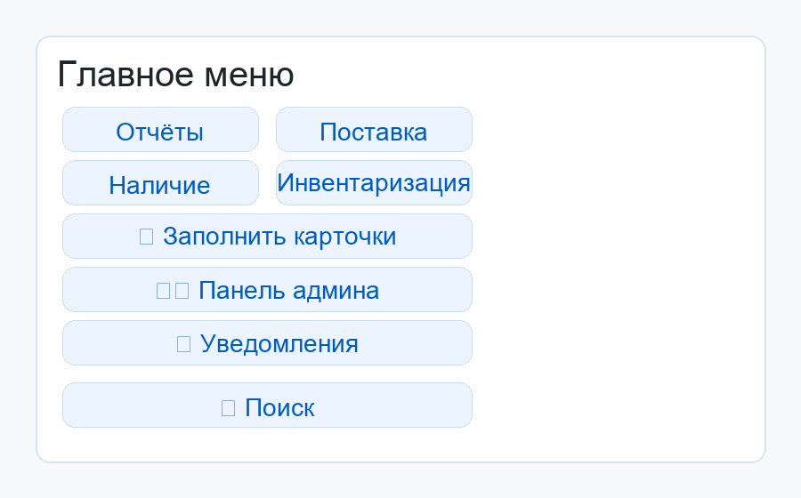
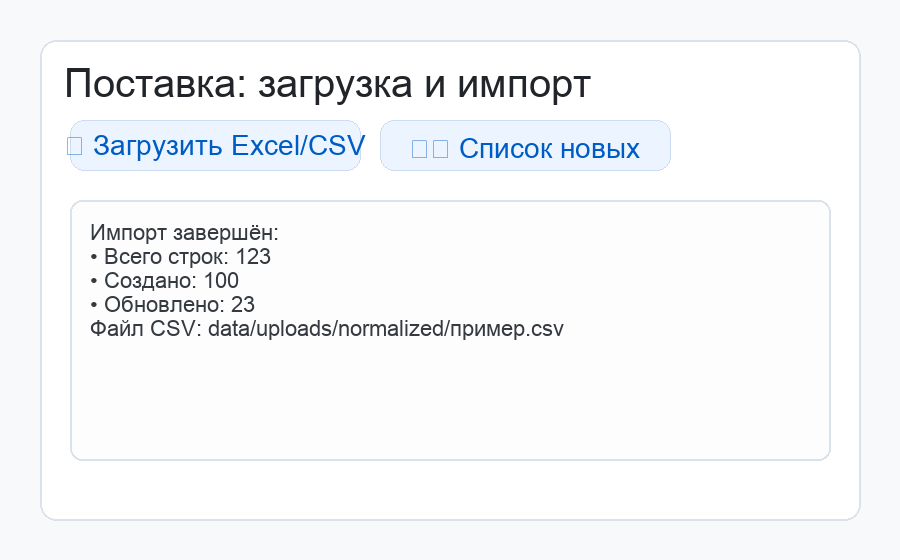
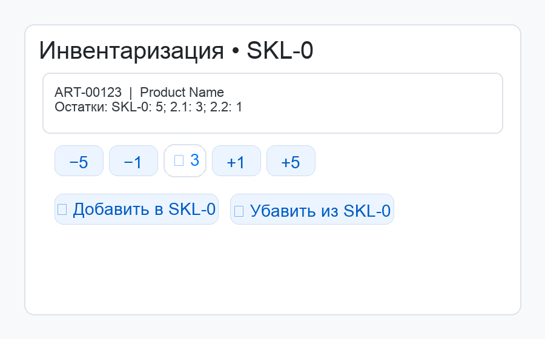

# MARM Bot — Telegram‑бот складского учёта (объединённый гайд)

Телеграм‑бот на aiogram 3.7 + Python 3.12 с локальной БД SQLite (WAL, FTS5 при наличии). Эта версия README объединяет детали из полного и краткого руководств и дополняет их иллюстрациями.

— Язык: Python 3.12 • Хранилище: SQLite • Точка входа: `app/main.py` • Пакет: `app/*`



## Содержание

1. Быстрый старт
2. Конфигурация
3. Ежедневные сценарии (с иллюстрациями)
4. Поиск (inline)
5. Отчёты (CSV)
6. Уведомления
7. Фото товаров
8. База данных и производительность
9. Параметры и директории
10. Стресс‑тесты
11. Развёртывание
12. Частые проблемы
13. Файловая карта

---

## 1) Быстрый старт

Требования
- Python 3.12 (macOS: `brew install python@3.12`)
- Интернет для зависимостей и Telegram API

Установка и запуск
- Автоматически (macOS): `./run_bot.command`
- Вручную (macOS/Linux/Windows):
```
python3.12 -m venv venv
source venv/bin/activate        # Windows: venv\Scripts\activate
pip install -U pip
pip install -r requirements.txt
python -m app.main
```

Первый вход
- Напишите боту `/start` с аккаунта главного админа (см. конфиг). Откроется «Главное меню».

### Локальная веб‑админка БД (красивый UI)

Запускает удобный интерфейс для просмотра и редактирования SQLite‑базы:

- Автоматически: `./run_admin.command`
  - Слушает на `0.0.0.0:${ADMIN_PORT:-8000}`
  - Доступ с этой машины: `http://127.0.0.1:8000`
  - Доступ из локальной сети: `http://<IP_этой_машины>:8000` (скрипт подскажет IP)
- Вручную:
```
python3.12 -m venv venv
source venv/bin/activate        # Windows: venv\Scripts\activate
pip install -U pip
pip install -r requirements.txt
python -m admin_ui              # по умолчанию 127.0.0.1:8000
# Для доступа из сети запустите так:
# ADMIN_HOST=0.0.0.0 ADMIN_PORT=8000 python -m admin_ui
```

Возможности:
- Просмотр любых таблиц/представлений, поиск по текстовым полям, сортировка, пагинация.
- Добавление/изменение/удаление строк для обычных таблиц с первичным ключом (PK).
- Для виртуальных таблиц/представлений — только чтение.
- UI на Bootstrap, работает локально, без авторизации (для локальной машины).

## 2) Конфигурация

`config.json` рядом с `app/main.py`:
```json
{
  "BOT_TOKEN": "<ваш_telegram_bot_token>",
  "SUPER_ADMIN_ID": 123456789,
  "SUPER_ADMIN_USERNAME": "@your_username"
}
```
Замены через окружение: `BOT_TOKEN`, `SUPER_ADMIN_ID`, `SUPER_ADMIN_USERNAME`.

## 3) Ежедневные сценарии

Иллюстрации ниже — макеты UI (для ориентира).

### 3.1 Поставка → импорт CSV



- «Поставка → 📄 Загрузить CSV». Перед загрузкой конвертируйте исходный файл в CSV: https://convertio.co/ru/xls-csv/
- Отправьте получившийся `.csv`.
- Файл нормализуется в `article,name,qty` → сохраняется в `data/uploads/normalized`.
- Новые товары помечаются `is_new=1`, остаток зачисляется в `SKL-0`.
- Разложите поступление через карточки или «Маршрут: откуда → куда».

### 3.2 Карточка товара

- Остатки по локациям, итог, локальное имя, фото.
- Быстрое списание: «В зал (−1)».
- Маршрут: выберите источник/назначение и количество, подтвердите.
- Спец‑кнопка «Всё из SKL‑0 → Х»: если есть единственная альтернативная локация.
- Заполнение карточки: «Добавить название», «Добавить фото» (JPEG ×0.5, кеш локально).

### 3.3 Инвентаризация



- «Инвентаризация» → выберите локацию → откройте позицию.
- Кнопками задайте количество (−5/−1/+1/+5, «✅ число») и примените «➕ Добавить в X» или «➖ Убавить из X».
- Корректировки атомарны, отрицательные остатки запрещены.

## 4) Поиск (inline)

В чате с ботом начните вводить запрос (название/артикул) и выберите подсказку. Префиксы:
- `INV ` — инвентаризация, вставляет `/inv_<id>`
- `NEW ` — только новые (`is_new=1`)
- `INC ` — незаполнённые карточки (нет локального имени/фото)
- `ADM ` — админ‑действия, вставляет `/admin_<id>`
  - Для админов также появляется пункт «➕ Создать товар: <запрос>», который отправляет `/admin_new <запрос>` и запускает мастер создания с выбором локации и количества.

Быстрая правка из чата (для админов):
- `/admin_set <id> <поле>=<значение>` — изменить напрямую, поля: `article`, `name`, `local_name`, `brand_country`, `is_new`.
  - Примеры: `/admin_set 123 name=Новое имя`, `/admin_set 123 is_new=0`.

Под капотом FTS5 (если доступно), иначе безопасный fallback на LIKE.

## 5) Отчёты (CSV)

- «Отчёты»: «Заканчиваются (<2)», «Нулевой остаток», «В достатке 3–5», «Все товары», «Архив».
- Файлы в `reports/` и отправка в чат.
  - Архивные товары автоматически помечаются, если при нулевом остатке не было пополнений 30 дней. Они скрыты из общего поиска и видны только в отчёте «Архив».

## 6) Уведомления

Типы: закончился, последняя пачка, поступило на склад. Режимы: `off` / `daily` / `instant`.
- Мгновенные — приходят сразу при событиях.
- Сводка — ежедневно в 21:10.
- Настройка: «Уведомления» в админке.

## 7) Фото товаров

- Отправьте фото в карточке — бот скачает оригинал, сожмёт до JPEG ×0.5 (`PHOTO_QUALITY`) и сохранит в `media/photos`.
- Повторная отправка заменит фото. Удаление — «Редактировать → Фото: удалить».

## 8) База данных и производительность

- SQLite WAL, `busy_timeout`, `synchronous=NORMAL` — устойчиво к конкуренции.
- Таблицы: `product`, `location`, `stock`, `user_role`, `user_notify`, `event_log`, виртуальная `product_fts`.
- Миграции/сидинг — при старте (`app/db.py`).

Архитектура (мермад)
```mermaid
flowchart LR
  User((User)) --> TG[Telegram]
  TG --> Bot[MARM Bot (aiogram)]
  Bot --> H1[Handlers: supply / stock / inventory / reports / admin]
  H1 --> S1[Services: imports]
  H1 --> S2[Services: stock]
  H1 --> S3[Services: notify]
  H1 --> S4[Services: photos]
  Bot --> DB[(SQLite: product / stock / ...)]
```

## 9) Параметры и директории

- БД: `data/marm.sqlite3`
- Загрузки: `data/uploads` → нормализованные CSV: `data/uploads/normalized`
- Фото: `media/photos`
- Отчёты: `reports`
- JPEG качество: `PHOTO_QUALITY = 85` (`app/config.py`)
- Пагинация: `PAGE_SIZE=10`, `CARDS_PAGE_SIZE=20`, `STOCK_PAGE_SIZE=30`

## 10) Стресс‑тесты

Проверка без Telegram:
```
python stress_test.py
```
Скрипт создаёт тестовую БД `data/stress.sqlite3`, импортирует тестовые CSV параллельно, выполняет массовые перемещения/инвентаризации, проверяет инварианты/FTS, имитирует уведомления, тестирует сжатие фото. Ожидайте `OVERALL: OK`.

## 11) Развёртывание

- systemd (Linux): укажите `ExecStart` на запуск в venv, доступ к файлам и переменным окружения (`BOT_TOKEN`, `SUPER_ADMIN_ID`, `SUPER_ADMIN_USERNAME`).
- macOS: `launchd` или `./run_bot.command` (терминал открыт), можно оформить как LaunchAgent.
- Windows (2 клика + самоподъём):
  - Двойной клик: `windows\install_marmbot.bat` — создаст venv, установит зависимости и зарегистрирует задачу Планировщика «MarmBot» с автозапуском и самовосстановлением.
  - Автозапуск: при входе в систему, при разблокировке рабочего стола и после выхода из сна (по событию `Power‑Troubleshooter/1`).
  - Самоподъём: при падении процесс перезапускается (повтор до 999 раз, пауза 10 сек). При разблокировке/пробуждении — перезапуск текущего экземпляра.
  - Управление:
    - Запустить сейчас: `windows\start_now.bat`
    - Остановить: `windows\stop.bat`
    - Перезапустить: `windows\restart_now.bat`
    - Удалить задачу: `windows\uninstall_marmbot.bat`
  - Точка входа: задача запускает `venv\Scripts\python.exe app\main.py` из корня репозитория. Конфиг берётся из `config.json` в этом же каталоге.

## 12) Частые проблемы

- Нет `BOT_TOKEN`/`SUPER_ADMIN_ID` — проверьте `config.json` или окружение.
- Нет Python 3.12 — установите (macOS: `brew install python@3.12`).
- Ошибки `.xls` — нужен `xlrd==1.2.0` (в `requirements.txt`).
- FTS падает — будет fallback на LIKE.
- «database is locked» при пиковой нагрузке — подождите/перезапустите; WAL и `busy_timeout` включены.
- Фото не видно — дождитесь кеширования или отправьте повторно.

---

## Контейнеризация (Docker)

Быстрый способ поднять бота и веб‑админку на любом хосте и открыть доступ к админке по локальному/ВПН‑IP (не `localhost`).

- Предустановки: Docker Engine + Docker Compose V2.

Шаги
- Скопируйте `.env.example` в `.env` и заполните:
  - `BOT_TOKEN`, `SUPER_ADMIN_ID`, `SUPER_ADMIN_USERNAME`
  - `ADMIN_PORT` (внешний порт админки, по умолчанию 8000)
- Запуск:
```
docker compose up -d --build
```
- Доступ к админке: `http://<IP_машины>:<ADMIN_PORT>`
  - Примеры IP: локальная сеть (192.168.x.x), адрес ВПН‑интерфейса — в зависимости от вашей VPN.
  - Убедитесь, что фаерволл/правила ВПН разрешают вход на выбранный порт.

Сервисы
- `admin` — Flask‑админка (`python -m admin_ui`), слушает на `0.0.0.0:8000` внутри контейнера.
- `bot` — Telegram‑бот (`python -m app.main`).

Данные (тома)
- `data` → `/app/data` (SQLite БД и загрузки)
- `media` → `/app/media` (фото)
- `reports` → `/app/reports` (CSV отчёты)

Управление
- Остановить: `docker compose down`
- Перезапустить после изменений кода: `docker compose up -d --build`
- Логи: `docker compose logs -f admin` и/или `docker compose logs -f bot`

Примечания
- Файл `config.json` умышленно не копируется в образ (см. `.dockerignore`). Секреты задаются через `.env`/переменные окружения.
- Админка в контейнере стартует с инициализацией БД при необходимости, поэтому может работать отдельно от бота.
- Путь к БД настраивается через `DB_PATH` (по умолчанию `data/marm.sqlite3`). Если у вас историческая база `data/marm.db`, пропишите `DB_PATH=data/marm.db` в `.env`.

## 13) Файловая карта

- Вход: `app/main.py`
- Конфиг/пути: `app/config.py`
- БД/схема/прагмы: `app/db.py`
- Импорт: `app/services/imports.py`
- Перемещения/инвентаризация: `app/services/stock.py`
- Уведомления: `app/services/notify.py`
- Фото: `app/services/photos.py`
- UI/тексты/клавиатуры: `app/ui/*`
- Хендлеры: `app/handlers/*`
