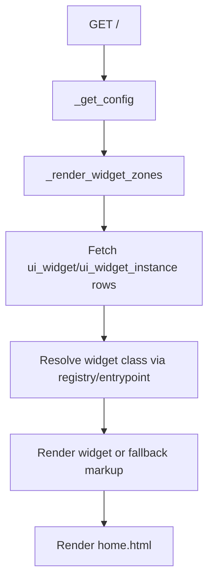
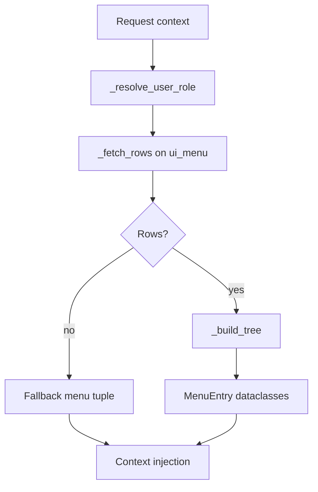
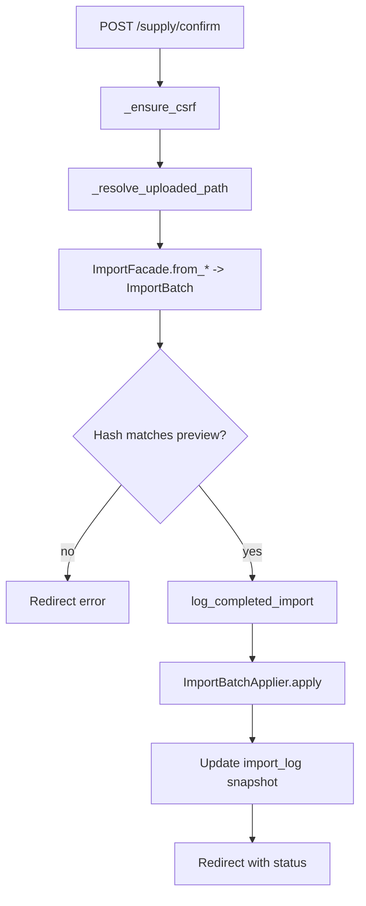
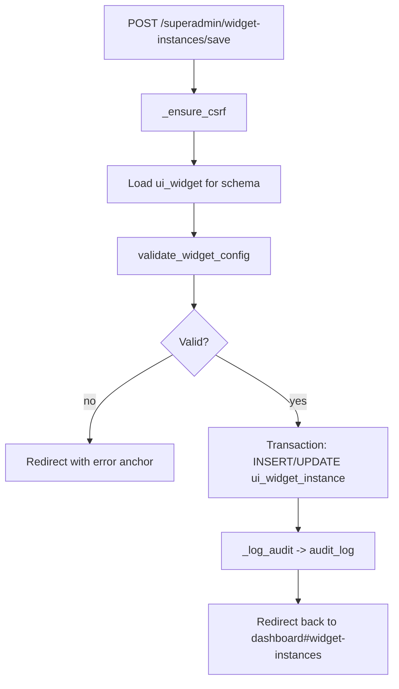
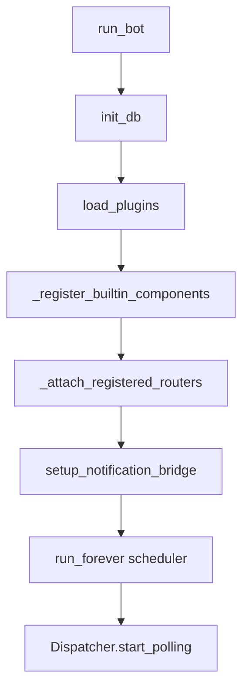
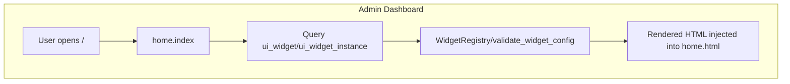
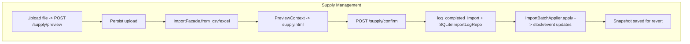
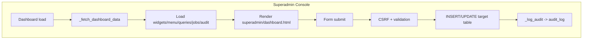

# Migration inventory

## Admin blueprint behaviours

### Dashboard (`dvorik/admin/blueprints/home.py`)

| Method | Path | Permission | Template | Supporting services |
| --- | --- | --- | --- | --- |
| GET | `/` | implicit login/session guard | `home.html` | Loads widget definitions via `WidgetRegistry`, renders instances with `WidgetContext`, and falls back to dynamic entrypoints when necessary. |

- The handler resolves the shared `DVORIK_CONFIG`, renders all enabled widget instances grouped by zone, and injects them into the dashboard template.【F:dvorik/admin/blueprints/home.py†L45-L156】
- Widget instances are hydrated from `ui_widget_instance`/`ui_widget`, validated with `validate_widget_config`, and rendered via the registered widget class or an importable entrypoint.【F:dvorik/admin/blueprints/home.py†L70-L155】



**Data dependencies:** `ui_widget`, `ui_widget_instance` tables; widget validation schemas; runtime config.

### Menu context (`dvorik/admin/blueprints/menus.py`)

| Hook | Scope | Purpose | Supporting services |
| --- | --- | --- | --- |
| `@app_context_processor` | All admin templates | Injects navigation tree (`menu_entries`) and whether it comes from DB. | Reads `ui_menu`, enforces role filters from session and superadmin status. |

- Menu rows are filtered by the active session role (including superadmin) before being nested; invalid or empty datasets trigger a fallback menu definition.【F:dvorik/admin/blueprints/menus.py†L55-L200】
- The tree builder guards against orphaned and cyclic relationships to ensure consistent navigation rendering.【F:dvorik/admin/blueprints/menus.py†L116-L183】



**Data dependencies:** `ui_menu` table; session role key `dvorik.role`; `require_superadmin` status helper.

### Generic table browser (`dvorik/admin/blueprints/tables.py`)

| Method | Path | Permission | Template | Supporting services |
| --- | --- | --- | --- | --- |
| GET | `/tables/` | implicit login | `tables/table.html` | Lists non-virtual SQLite tables, counts rows. |
| GET | `/tables/<table>/` | implicit login | `tables/table.html` | Pages through table rows using `rowid`. |
| GET | `/tables/<table>/new` | implicit login | `tables/form.html` | Renders create form based on PRAGMA metadata. |
| POST | `/tables/<table>/new` | CSRF-protected | `tables/form.html` on validation error | Inserts rows, skipping autoincrement PKs. |
| GET | `/tables/<table>/<rowid>/edit` | implicit login | `tables/form.html` | Loads values for editing. |
| POST | `/tables/<table>/<rowid>/edit` | CSRF-protected | `tables/form.html` on validation error | Applies updates per column. |
| POST | `/tables/<table>/<rowid>/delete` | CSRF-protected | redirect | Deletes row by `rowid`. |

- Table metadata and rows are discovered dynamically via `sqlite_master`, `PRAGMA table_info`, and direct `SELECT` statements so the UI adapts to schema changes.【F:dvorik/admin/blueprints/tables.py†L42-L389】
- Form submissions normalise blank values to `NULL`, guard against missing required fields, and redirect with status indicators when operations succeed or fail.【F:dvorik/admin/blueprints/tables.py†L114-L267】

```mermaid
flowchart TD
    A[POST /tables/<table>/new] --> B[_ensure_csrf]
    B --> C[_fetch_table_columns]
    C --> D[Normalise form payload]
    D --> E{Validation errors?}
    E -- yes --> F[Render tables/form.html]
    E -- no --> G[INSERT via db()]
    G --> H[Redirect with status]
```

**Data dependencies:** All non-virtual SQLite tables exposed by `sqlite_master`; relies on CSRF validation and shared database connection helper.

### Supply imports (`dvorik/admin/blueprints/supply.py`)

| Method | Path | Permission | Template | Supporting services |
| --- | --- | --- | --- | --- |
| GET | `/supply/` | `require_superadmin` | `supply.html` | Lists recent imports via `SQLiteImportLogRepo.latest`. |
| POST | `/supply/preview` | `require_superadmin` + CSRF | `supply.html` | Stores upload, infers importer type through `ImportFacade`, renders preview. |
| POST | `/supply/confirm` | `require_superadmin` + CSRF | redirect | Rehydrates batch, logs import, applies stock via `ImportBatchApplier`. |
| POST | `/supply/<import_id>/revert` | `require_superadmin` + CSRF | redirect | Loads stored snapshot and reverts stock movements. |

- Upload previews persist files under the configured uploads directory, instantiate an `ImportBatch`, and surface the first rows alongside derived metadata for confirmation.【F:dvorik/admin/blueprints/supply.py†L82-L200】
- Confirming an import writes to `import_log`, invokes `log_completed_import`, applies stock changes through `ImportBatchApplier`, and persists snapshots for later revert attempts.【F:dvorik/admin/blueprints/supply.py†L200-L368】
- Reverts pull stored JSON snapshots, replay inverse operations via the applier, and mark the `import_log` entry as reverted in the repository.【F:dvorik/admin/blueprints/supply.py†L308-L369】



**Data dependencies:** `import_log`, `stock`, `product`, `location`, `supplier` tables via import services; file storage roots from runtime config.

### Superadmin console (`dvorik/admin/blueprints/superadmin.py`)

| Method | Path | Permission | Template | Supporting services |
| --- | --- | --- | --- | --- |
| GET | `/superadmin/` | `require_superadmin` | `superadmin/dashboard.html` | Aggregates widgets, menu entries, queries, jobs, audit logs, plugin descriptors. |
| POST | `/superadmin/widgets/save` | `require_superadmin` + CSRF | redirect | Upserts `ui_widget` entries and logs to `audit_log`. |
| POST | `/superadmin/widgets/delete` | `require_superadmin` + CSRF | redirect | Deletes widget definitions with audit trail. |
| POST | `/superadmin/widget-instances/save` | `require_superadmin` + CSRF | redirect | Validates instance config, upserts `ui_widget_instance`, audits changes. |
| POST | `/superadmin/widget-instances/delete` | `require_superadmin` + CSRF | redirect | Deletes widget instances with auditing. |
| POST | `/superadmin/menu/save` | `require_superadmin` + CSRF | redirect | Manages `ui_menu` entries and role requirements. |
| POST | `/superadmin/menu/delete` | `require_superadmin` + CSRF | redirect | Removes `ui_menu` entries with audit log. |
| POST | `/superadmin/queries/save` | `require_superadmin` + CSRF | redirect | Upserts `query_registry` SQL snippets. |
| POST | `/superadmin/queries/delete` | `require_superadmin` + CSRF | redirect | Removes stored queries. |
| POST | `/superadmin/jobs/save` | `require_superadmin` + CSRF | redirect | Upserts `scheduled_job` records, including cron/daily metadata. |
| POST | `/superadmin/jobs/delete` | `require_superadmin` + CSRF | redirect | Deletes scheduled jobs. |

- The dashboard hydrates summary lists from `ui_widget`, `ui_widget_instance`, `ui_menu`, `query_registry`, `scheduled_job`, and `audit_log`, and appends plugin metadata from `get_plugins()` for visibility.【F:dvorik/admin/blueprints/superadmin.py†L21-L711】
- Each management form validates input, enforces CSRF tokens, persists the appropriate table changes inside a transaction, and records an audit entry capturing the payload and actor metadata.【F:dvorik/admin/blueprints/superadmin.py†L40-L800】



**Data dependencies:** `ui_widget`, `ui_widget_instance`, `ui_menu`, `query_registry`, `scheduled_job`, `audit_log`; relies on plugin registry and actor headers for auditing.

## Schema catalogue and consumers

| Table / Index | Purpose | Primary consumers |
| --- | --- | --- |
| `manufacturer` | Normalised manufacturer catalogue referenced by products.【F:dvorik/db/migrations.py†L16-L55】 | `SQLiteProductRepo` joins manufacturers when building product detail projections.【F:dvorik/repo/product_repo.py†L140-L201】 |
| `supplier` & `supplier_sku`, `idx_supplier_sku_*` | Supplier master data and SKU cross-references, enforcing uniqueness per supplier and fast lookups.【F:dvorik/db/migrations.py†L23-L260】 | Import pipeline normalises suppliers, and product details expose supplier SKUs via the product repository.【F:dvorik/services/supply.py†L1290-L1386】【F:dvorik/repo/product_repo.py†L210-L244】 |
| `product`, `idx_product_article`, `idx_product_name` | Core catalogue with pricing, archival, and manufacturer linkages.【F:dvorik/db/migrations.py†L30-L55】 | Queried throughout product and stock repositories, supply imports, and bot stock search cards.【F:dvorik/repo/product_repo.py†L28-L200】【F:dvorik/repo/stock_repo.py†L56-L178】【F:dvorik/services/imports/__init__.py†L632-L643】 |
| `location` & `stock`, `idx_stock_location` | Physical locations and per-location stock with composite PK.【F:dvorik/db/migrations.py†L57-L81】 | Stock repository projections, supply imports/applier, notification formatter, and bot stock commands rely on these tables.【F:dvorik/repo/stock_repo.py†L26-L193】【F:dvorik/admin/blueprints/supply.py†L200-L368】【F:dvorik/bot/notifications.py†L154-L167】 |
| `user_role` | Telegram identity to role bindings for access control.【F:dvorik/db/migrations.py†L83-L101】 | Menu context resolver reads session role and falls back to superadmin privileges; stored roles back future access checks.【F:dvorik/admin/blueprints/menus.py†L185-L200】 |
| `user_notify` | Stores notification preferences per user and type.【F:dvorik/db/migrations.py†L94-L101】 | Notification subsystem can expand consumers when daily/instant modes are wired to dispatchers.【F:dvorik/bot/notifications.py†L40-L125】 |
| `event_log`, `idx_event_log_*` | Audit trail for inventory events and movement payloads.【F:dvorik/db/migrations.py†L102-L117】 | Supply service logs SKL transfers; stock services append contextual payloads for adjustments and moves.【F:dvorik/services/supply.py†L40-L53】【F:dvorik/services/stock.py†L262-L268】 |
| `import_log`, `idx_import_log_created` | History of uploaded supply batches with snapshot JSON for revert.【F:dvorik/db/migrations.py†L119-L135】 | Supply blueprint via `SQLiteImportLogRepo`, `log_completed_import`, and revert workflows.【F:dvorik/admin/blueprints/supply.py†L200-L368】【F:dvorik/repo/import_repo.py†L20-L148】 |
| `product_merge_log`, `product_article_alias`, `product_name_alias`, `product_merge_rule`, indexes | Capture merge operations, alias history, and automatic rule hints.【F:dvorik/db/migrations.py†L138-L197】 | Product merge service writes histories, alias reassignments, and supports undo/history views.【F:dvorik/services/product_merge.py†L400-L700】 |
| `schedule_day`, `schedule_assignment`, `schedule_transfer_request`, `schedule_anchor` | Workforce scheduling calendar, assignments, transfer requests, and anchor metadata.【F:dvorik/db/migrations.py†L200-L229】 | Schedule repository exposes read models, admin bot summarises pending transfer requests.【F:dvorik/repo/schedule_repo.py†L17-L135】【F:dvorik/bot/routers/admin.py†L134-L154】 |
| `registration_request` | Pending access requests awaiting approval.【F:dvorik/db/migrations.py†L232-L241】 | Admin bot lists newest pending registrations in its overview.【F:dvorik/bot/routers/admin.py†L112-L164】 |
| `display_name_exception` | Manual overrides for display-name normalisation rules.【F:dvorik/db/migrations.py†L262-L266】 | Reserved for upcoming normalisation tweaks; no active runtime consumer yet. |
| `product_fts` virtual table + triggers | Full-text index that shadows `product` names/articles for FTS search.【F:dvorik/db/migrations.py†L269-L292】 | Product repository FTS search powers `/stock` bot lookups and other catalogue queries.【F:dvorik/repo/product_repo.py†L97-L138】【F:dvorik/bot/routers/stock.py†L92-L135】 |
| `query_registry` | Stores override SQL snippets for repositories and superadmin editing.【F:dvorik/db/migrations.py†L295-L300】 | `get_query` pulls overrides when repositories execute statements; superadmin UI edits entries.【F:dvorik/db/query_registry.py†L8-L56】【F:dvorik/admin/blueprints/superadmin.py†L389-L475】 |
| `ui_widget`, `ui_widget_instance`, `ui_menu`, `idx_ui_menu_required_role` | Dynamic admin UI configuration, widget placement, and navigation metadata.【F:dvorik/db/migrations.py†L302-L338】 | Home dashboard render pipeline, menu context processor, and superadmin CRUD screens manipulate these tables.【F:dvorik/admin/blueprints/home.py†L70-L155】【F:dvorik/admin/blueprints/menus.py†L55-L200】【F:dvorik/admin/blueprints/superadmin.py†L40-L357】 |
| `scheduled_job` | Declarative job scheduler registry for background tasks.【F:dvorik/db/migrations.py†L340-L351】 | Superadmin job forms manage entries; `JobRegistry` exposes runtime jobs for the admin bot overview.【F:dvorik/admin/blueprints/superadmin.py†L477-L603】【F:dvorik/bot/routers/admin.py†L100-L133】 |
| `audit_log`, `idx_audit_log_created` | Immutable audit entries for privileged actions with optional payload JSON.【F:dvorik/db/migrations.py†L353-L364】 | Superadmin dashboard displays recent entries; import services and UI actions append records with actor context.【F:dvorik/admin/blueprints/superadmin.py†L606-L790】【F:dvorik/services/imports/__init__.py†L645-L691】 |

## Telegram bot flows

### Runtime bootstrap

- `run_bot` resolves configuration, initialises the SQLite schema, loads plugins, registers built-in routers, starts the scheduler loop, and bridges notification events before polling Telegram updates.【F:dvorik/bot/main.py†L24-L55】
- The notification bridge subscribes to `bot.notifications.generated`, formats threshold/movement/digest payloads using product and location lookups, and sends messages to the configured superadmin chat IDs.【F:dvorik/bot/notifications.py†L24-L170】



### Registered routers and interactions

| Router | Commands / Callbacks | Downstream services |
| --- | --- | --- |
| `builtin.core` | `/start`, `/ping`, callback namespace `builtin.core` for status/feedback buttons.【F:dvorik/bot/routers/core.py†L20-L101】 | Uses keyboard factories, reports scheduler heartbeat age via `dvorik.core.scheduler`. |
| `builtin.admin` | `/admin` overview, callbacks for jobs/requests/refresh under `builtin.admin` namespace.【F:dvorik/bot/routers/admin.py†L29-L187】 | Summarises registered jobs from `JobRegistry`, pending `registration_request` rows, and `ScheduleTransferRequest` records via `SQLiteScheduleRepo`. |
| `builtin.stock` | `/stock <query>` search, callbacks for low-stock/help in `builtin.stock` namespace.【F:dvorik/bot/routers/stock.py†L30-L206】 | Queries `SQLiteProductRepo` (including FTS), `SQLiteStockRepo`, and formats cards with per-location stock snapshots. |
| `builtin.supply` | `/supply` placeholder, callbacks for roadmap messaging in `builtin.supply` namespace.【F:dvorik/bot/routers/supply.py†L15-L58】 | Currently informational; signals forthcoming integration with supply import services. |

**Webhook/API contract implications:**

- Routers assume HTML parse mode and may send photos for stock cards; webhook handlers must preserve Aiogram’s message/keyboard payload shape.【F:dvorik/bot/main.py†L35-L55】【F:dvorik/bot/routers/stock.py†L101-L111】
- Background scheduler heartbeat responses rely on `scheduler.heartbeat()`/`heartbeat_age()` staying synchronous and lightweight for `/ping` latency.【F:dvorik/bot/routers/core.py†L68-L98】
- Admin callbacks trigger additional messages/edits; Telegram errors (e.g., message edits) fall back to sending new messages, so webhook retries should tolerate idempotent updates.【F:dvorik/bot/routers/admin.py†L49-L74】

## Page-level data flow diagrams

The following diagrams capture end-to-end dependencies so migration work can preserve data contracts.





```mermaid
flowchart TD
    subgraph Tables CRUD
        C1[User edits row] --> C2[POST /tables/<table>/<rowid>/edit]
        C2 --> C3[CSRF + PRAGMA metadata]
        C3 --> C4[UPDATE table via db()]
        C4 --> C5[Redirect with status query]
    end
```



```mermaid
flowchart TD
    subgraph Bot Stock Search
        E1[/stock query] --> E2[_search_stock_cards]
        E2 --> E3[SQLiteProductRepo.search_fts]
        E3 --> E4[SQLiteStockRepo.stock_by_location]
        E4 --> E5[Rendered product cards]
        E5 --> E6[Telegram messages/photos]
    end
```

These charts emphasise which database assets, services, and templates a given page or flow depends on, helping to sequence migration tasks safely.
